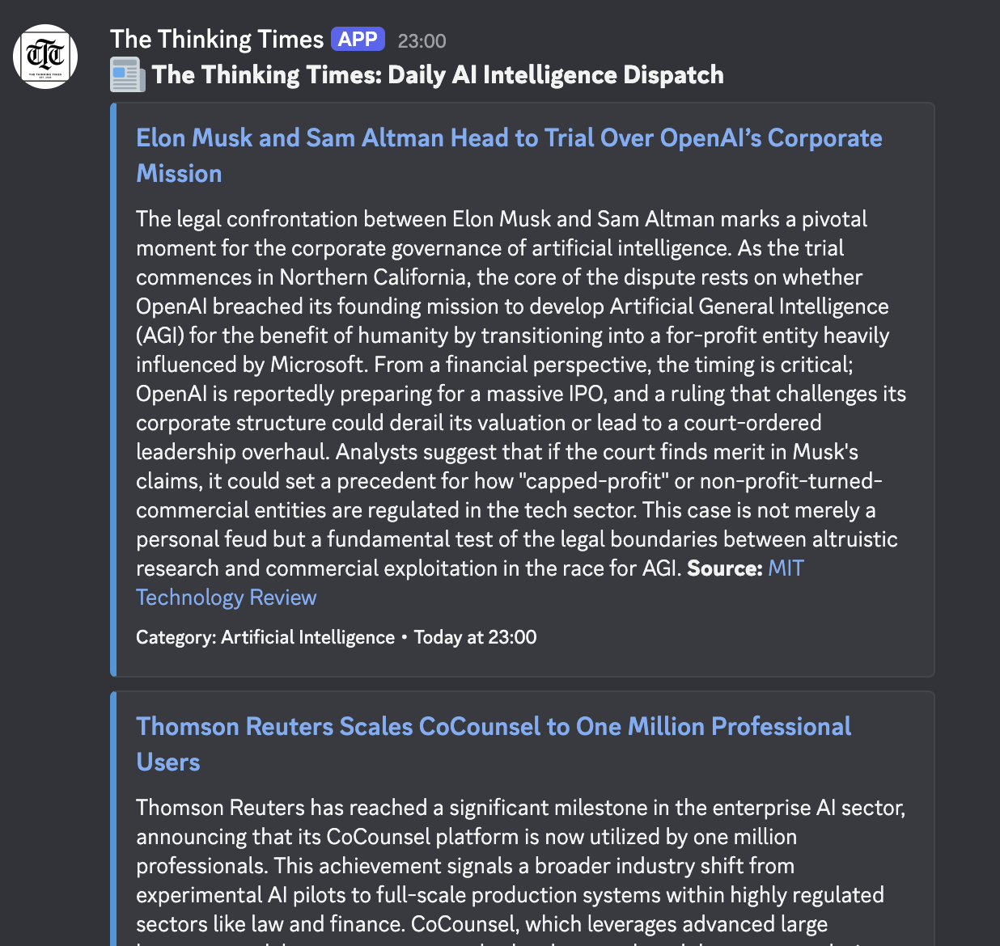
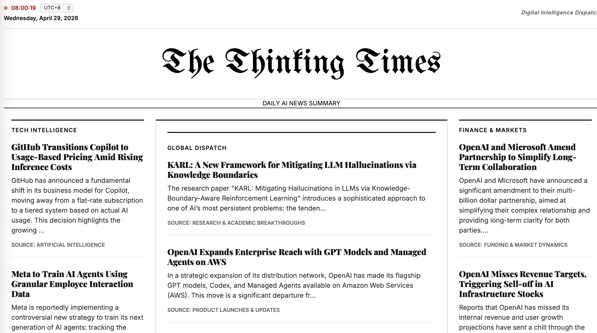

***

# The Thinking Times: Daily AI Intelligence Dispatch
  


<div align="center">
  <a href="https://discord.com/oauth2/authorize?client_id=1499052107180015697&permissions=377957210112&integration_type=0&scope=bot">
    
  </a>
</div>

**The Thinking Times** is an automated news aggregation and intelligence platform. It leverages Large Language Models (LLMs)—specifically **Gemini 3 Flash** or **Kimi K2.5** to fetch, curate, and summarize the most critical daily developments across Artificial Intelligence, Finance, and Global News. 

The system operates as a "Senior Industry Analyst," transforming raw RSS feeds into a high-density, analytical news digest delivered via a **Hybrid Discord Notification System** (supporting both Webhooks and multi-server Bots) and a classic newspaper-style web interface.

<p align="center">
  
  
</p>


## 🚀 System Architecture

The project is divided into an automated backend processing pipeline and a clean "New Times" styled frontend.

### 1. Intelligence Pipeline (`generate_news.py`)
* **Source Aggregation**: Uses `feedparser` to ingest news from 20+ high-authority sources across three domains: AI & Tech, Finance, and General World News.
* **Stage 1: Multi-Criteria Selection**: The LLM evaluates hundreds of raw stories based on sector-defining impact, policy shifts, and technical breakthroughs to select the top 15-20 items.
* **Stage 2: Analytical Summarization**: Generates in-depth summaries (150-200 words) for each selected item, focusing on technical details and business implications.
* **Hybrid Dispatch**: Simultaneously broadcasts to a single-channel **Webhook** and a multi-server **Discord Bot**.
* **Automated Parsing**: A robust regex-based parser extracts the LLM's structured Markdown output into a machine-readable `news.json`.

### 2. Frontend Interface (`index.html` / `script.js`)
* **NYT-Style Layout**: A three-column grid organizing news into *Tech Intelligence*, *Global Dispatch*, and *Finance & Markets*.
* **Dynamic Filtering**: The JavaScript frontend dynamically categorizes articles from `news.json` using keyword-based domain relevance.
* **Live Intelligence Tools**: Includes a real-time world clock with UTC offset selection for global analysts.

## 🛠️ Technical Stack

* **Language**: Python 3.10+
* **AI Engine**: Google Gemini 3 Flash
* **Discord Integration**: `discord.py` (Bot) & `requests` (Webhook)
* **Frontend**: Vanilla HTML5, CSS3, and JavaScript (ES6+)
* **Libraries**: `feedparser`, `openai`, `requests`, `PyYAML`, `discord.py`

## 📋 Configuration (`config.yaml`)

You can customize the "personality" and sources of the bot in the `config.yaml` file:
* **Model Selection**: Toggle between different LLM providers.
* **RSS Feeds**: Add or remove sources from the `feeds` section.
* **Discord Bot**: Set the target channel name (e.g., `the-thinking-times`) where the bot will post in all servers.
* **Prompt Engineering**: Adjust the `stage1` and `stage2` templates to change the analytical tone or summary length.

## ⚙️ Setup & Deployment

### 1. Environment Variables
The system requires the following keys in your GitHub Secrets:
* `GEMINI_API_KEY`: Your Google AI Studio API key.
* `DISCORD_WEBHOOK_URL`: (Optional) URL for a specific Discord channel webhook.
* `DISCORD_BOT_TOKEN`: (Optional) Your Discord Bot Token for multi-server broadcasting.

### 2. Discord Bot Setup
To use the multi-server bot feature:
1. Create a bot in the [Discord Developer Portal](https://discord.com/developers/applications).
2. Enable **Message Content Intent** and **Server Members Intent**.
3. Invite the bot to your servers and ensure a channel named `#the-thinking-times` exists.

### 3. Installation & Local Execution
```bash
pip install -r requirements.txt
python generate_news.py
```

### 4. GitHub Actions Automation
The repository runs daily at **08:13 HKT** via GitHub Actions. It commits the updated `news.json` to update the website and triggers the Discord dispatch.

---

## 📂 Project Structure
```
.
├── .github/workflows/   # GitHub Workflow Automation
├── config.yaml          # Feed & Prompt Config
├── generate_news.py     # Python Logic
├── index.html           # Web Layout
├── script.js            # Fetching and Rendering
├── news.json            # The Data (JSON format)
└── style.css            # The Style (NYT Inspired)
```
***
*&copy; 2026 The Thinking Times.*
